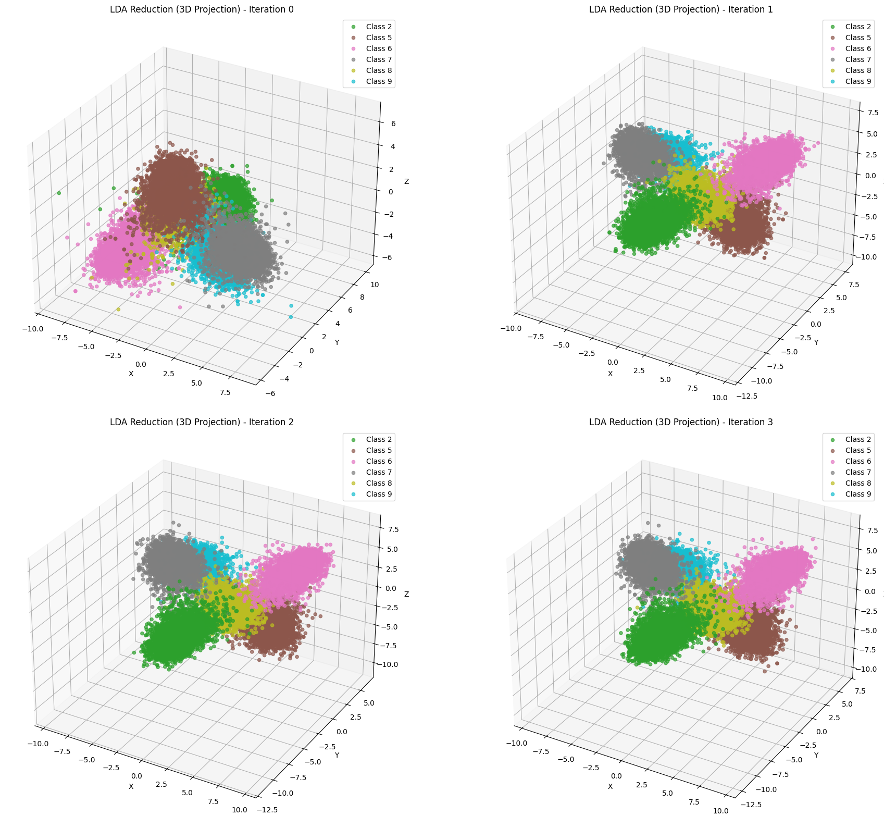
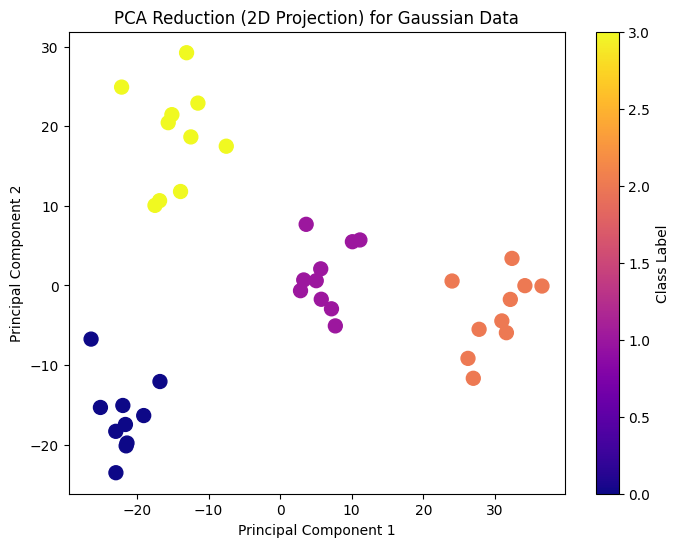

# pyLOT

This tutorial will guide you through the functionalities of the pyLOT library for linearized optimal transport (LOT).  LOT is used to transform point-cloud-valued data or, more specifically, measure-valued data into an $L_2$ space.  Once in this $L_2$ space, one can perform many of the machine learning techniques that are available in other packages.  For many problems, this framework also saves tons of computation time.  LOT works by using optimal transport (OT) by sending each measure-valued data point to an optimal transport map with respect to a fixed reference measure $\sigma$:
$$ LOT_\sigma (\mu) = {\arg\min}_{T: T_\sharp \sigma = \mu} \int_{\mathbb{R}^d} \Vert T(x) - x \Vert d\sigma(x).$$
To reconstruct measures from the LOT embedding, one simply pushes forward the reference measure by the LOT embedding (which applies the exponential map on the Wasserstein manifold).


The functionality available for this library is:
1. embedding measure-valued data using LOT.
2. dimensionality reduction using the LOT embedding.
3. generating new data using barycenters from the LOT embedding and pushing the reference measure forward with the LOT barycenter.
4. classification in the LOT embedding space.

This guide will demonstrate how to use this library effectively by using two toy examples:  MNIST data and multivariate Gaussian data.


```python
# Import necessary classes from the pyLOT library
from pyLOT.classifier import LOTClassifier
from pyLOT.barycenters import LOTBarycenter
from pyLOT.embed import LOTEmbedding
from pyLOT.reduction import LOTDimensionalityReduction
# libraries for computation and plotting
import numpy as np
import matplotlib.pyplot as plt
from matplotlib.colors import ListedColormap
# libraries for PCA visualization
from sklearn.model_selection import train_test_split
from sklearn.decomposition import PCA
from tensorflow.keras.datasets import mnist
import time
# Set a random seed for reproducibility
np.random.seed(42)

```

# Generating MNIST and Toy Data

We will showcase the code by how it performs using MNIST handwritten digits as well as regular multivariate Gaussian point clouds.  The reason for both these data examples is that MNIST data has inherent masses associated to each point in its point cloud whereas the Gaussian data can be treated as having the uniform measure over the points in the point cloud. All these steps to generate both the MNIST and Gaussian data are in the `tutorial_data_generation.py` file.

## MNIST data generation

Here, we use the handwritten digits MNIST data.  We generate normalized point clouds from the 2D MNIST digit images through the following steps:

1. We normalize the mass associated to each nonzero index of the 2D image so that the total mass associated to the pixels sums to 1.
2. We store the point clouds, their associated masses, and labels in data structures to keep track of everything.
3. We visualize the data to show you the images.

## Multivariate Gaussian data generation

For this toy data, we will create four classes of point-cloud-valued data, where each point cloud lives in three dimensions.  The data will be generated from multivariate Gaussians that are noisy versions of some ideal 3D multivariate Gaussians.


```python
from pyLOT.tutorial_data_generation import generate_mnist_clouds, generate_gauss_point_clouds

# Generate MNIST clouds, masses, and labels
mnist_pclouds, mnist_masses, mnist_labels, mnist_class_clouds = generate_mnist_clouds()
# mnist_pclouds: List of 2D arrays, each containing the point cloud for one image
# mnist_masses: List of 1D arrays, each containing the normalized masses for the corresponding point cloud
# mnist_labels: List of integers, each corresponding to the label of the associated point cloud
# mnist_class_clouds: A list of lists of 2D arrays, where each sublist contains the point clouds for one class

# Set parameters
n_samples_per_cloud = 100 # Number of samples in each point cloud
num_classes = 4 # Number of different classes
n_features = 3 # Number of features (dimensions) for each point cloud
n_clouds_per_class = 10 # Number of point clouds per class
noise_std = 0.5 # Standard deviation of the noise added to the mean of each cloud

# Generate the Gaussian point clouds and labels
gauss_pclouds, gauss_labels, gauss_class_clouds = generate_gauss_point_clouds(num_classes, 
                                                      n_samples_per_cloud, 
                                                      n_features, 
                                                      n_clouds_per_class, 
                                                      base_means = None, 
                                                      noise_std=noise_std)


```

Let's visualize the MNIST data before we begin with any of the LOT work.


```python

# Visualize the first point cloud from each MNIST class in a 5x5 grid of subplots
fig, axes = plt.subplots(5, 5, figsize=(15, 15))
axes = axes.flatten()

colors = ['r', 'b', 'g', 'm', 'c', 'y', 'k', 'orange', 'purple', 'brown']
idx = 0
for class_id in range(10):
    ax = axes[class_id]
    # Swap x and y to correct the orientation
    ax.scatter(mnist_class_clouds[class_id][idx][:, 1], 
               mnist_class_clouds[class_id][idx][:, 0], 
               c=colors[class_id], alpha=0.7, s=10)
    ax.set_title(f"MNIST Class {class_id}")
    ax.set_xlim([0, 28])
    ax.set_ylim([0, 28])
    ax.invert_yaxis()  # Keep the y-axis inverted to match the image coordinates
    ax.set_xticks([])
    ax.set_yticks([])

# Hide any empty subplots (in the last row)
for i in range(10, 25):
    fig.delaxes(axes[i])

plt.tight_layout()
plt.title('MNIST visualization')
plt.show()

```


    

    


Here, we visualize the multivariate Gaussian point cloud data before embedding or performing any of the LOT functionality.


```python
# Visualize the point clouds in 3D
fig = plt.figure(figsize=(10, 8))
ax = fig.add_subplot(111, projection='3d')

colors = ['r', 'b', 'g', 'm']
for class_id in range(4):
    curr_class_pcloud = np.concatenate(gauss_pclouds[gauss_labels == class_id], axis=0)
    ax.scatter(curr_class_pcloud[:, 0], 
               curr_class_pcloud[:, 1], 
               curr_class_pcloud[:, 2], 
               c=colors[class_id], label=f'Class {class_id}', alpha=0.7)

ax.set_title("3D Point Clouds with Noise")
ax.set_xlabel("X")
ax.set_ylabel("Y")
ax.set_zlabel("Z")
ax.legend()
plt.show()

```


    

    


# LOT Embedding

Now, we use the LOTEmbedding class to compute the optimal transport map from a reference measure to each point clouds. For both the MNIST example and 3D standard multivariate Gaussian examples, we will use Gaussians for reference measures.

Notice that the choice of reference measure is quite important. In some instances, using reference measures that are "compatible" with the data will generate a better LOT embedding.  The barycenters of your data may be useful for finding "compatible" reference measures and generate better embeddings.

For the case of MNIST images, we will center the reference measure at 14 (same as the MNIST data) and multiply with a standard deviation of 14/3, which ensures 99.7% of the samples will range from 0 to 28 in both the x and y dimensions.

For the Gaussian point clouds, we will simply generate a 3D standard multivariate Gaussian.


```python
# generate Gaussian reference for MNIST data
mnist_mean = np.array([14, 14])  # Desired mean of the Gaussian
mnist_sigma = 14 / 3            # Standard deviation (ensures 99.7% of samples are in [0,28]
# Generate standard normal samples
mnist_reference_points = 200
# Standard normal samples with mean 0 and std 1
xr_mnist = np.random.randn(mnist_reference_points, 2)
# Transform the samples to the desired Gaussian reference distribution
xr_mnist = mnist_mean + mnist_sigma * xr_mnist

print('Generating embeddings for MNIST data...')
start_time = time.time()
# Compute LOT embeddings using the LOT embedding method for MNIST data
mnist_embeddings = LOTEmbedding.embed_point_clouds(xr_mnist, 
                                                   mnist_pclouds,
                                                   xt_masses=mnist_masses,
                                                   sinkhorn=False, lambd=5)
mnist_time_taken = time.time() - start_time
print(f'Time taken for MNIST embeddings: {mnist_time_taken:.2f} seconds')


# generate Gaussian reference for Gaussian point cloud data
xr_gauss = np.random.randn(n_samples_per_cloud, n_features)  # Reference point cloud
print('Generating embeddings for Gaussian data...')
start_time = time.time()
# Compute LOT embeddings using the LOT embedding method for Gaussian data
gauss_embeddings = LOTEmbedding.embed_point_clouds(xr_gauss, gauss_pclouds, 
                                                   sinkhorn=False, lambd=1)
gauss_time_taken = time.time() - start_time
print(f'Time taken for Gaussian embeddings: {gauss_time_taken:.2f} seconds')

```

    Generating embeddings for MNIST data...
    Time taken for MNIST embeddings: 105.40 seconds
    Generating embeddings for Gaussian data...
    Time taken for Gaussian embeddings: 0.09 seconds


# Dimensionality Reduction and Plotting

Our pyLOT library allows for performing LDA and PCA for dimensionality reduction. To get a better sense of the dimensionality reduction in action, we visualize only a subset of the MNIST images and all of the Gaussian embeddings.

## MNIST dimensionality reduction

Let's begin with preparing the MNIST embeddings for LDA and PCA.


```python
# subset of MNIST images for embedding
plot_labels = [2, 5, 7, 8]
# generate mnist embeddings and labels for just the labels above
mnist_plot_embs = [mnist_embeddings[mnist_labels==label] for label in plot_labels]
mnist_plot_embs = np.concatenate(mnist_plot_embs, axis=0)
mnist_plot_labels = [mnist_labels[mnist_labels==label] for label in plot_labels]
mnist_plot_labels = np.concatenate(mnist_plot_labels, axis=0)
```

### MNIST LDA

Let's run LDA reduction for these MNIST embeddings.


```python
# generate LDA embeddings
T_lda, labels_balanced = LOTDimensionalityReduction.lda_reduction(mnist_plot_embs, 
                                                                  mnist_plot_labels,
                                                                  n_components=2)

# Visualize LDA in 2D
plt.figure(figsize=(8, 6))
scatter = plt.scatter(T_lda[:, 0], T_lda[:, 1], c=labels_balanced, cmap='coolwarm', s=100)
plt.title("LDA Reduction (2D Projection) for MNIST")
plt.xlabel("LDA Component 1")
plt.ylabel("LDA Component 2")
plt.colorbar(scatter, label="Class Label")
plt.show()
```


    

    


### MNIST PCA

Now, let us run PCA reduction to the MNIST embeddings.


```python
# Perform PCA reduction and visualize the result
U, S, Vh, \
    labels_balanced = LOTDimensionalityReduction.pca_reduction(mnist_plot_embs, 
                                                               mnist_plot_labels)
pclouds_pca = U @ np.diag(S)  # Project the data onto the first few principal components

plt.figure(figsize=(8, 6))
scatter = plt.scatter(pclouds_pca[:, 0], pclouds_pca[:, 1], 
                      c=labels_balanced, cmap='plasma', s=100)
plt.title("PCA Reduction (2D Projection) for MNIST")
plt.xlabel("Principal Component 1")
plt.ylabel("Principal Component 2")
plt.colorbar(scatter, label="Class Label")
plt.show()
```


    

    


### Gaussian LDA

Now we perform dimensionality reduction on the Gaussian data and plot it.


```python
T_lda, labels_balanced = LOTDimensionalityReduction.lda_reduction(gauss_embeddings, 
                                                                  gauss_labels,
                                                                  n_components=2)
# Visualize LDA in 2D
plt.figure(figsize=(8, 6))
scatter = plt.scatter(T_lda[:, 0], T_lda[:, 1], c=labels_balanced, cmap='coolwarm', s=100)
plt.title("LDA Reduction (2D Projection) for Gaussian Data")
plt.xlabel("LDA Component 1")
plt.ylabel("LDA Component 2")
plt.colorbar(scatter, label="Class Label")
plt.show()
```


    

    


### Gaussian PCA

Let's run the PCA reduction for the Gaussian embeddings.


```python
# Perform PCA reduction and visualize the result
U, S, Vh, \
    labels_balanced = LOTDimensionalityReduction.pca_reduction(gauss_embeddings, 
                                                               gauss_labels)
pclouds_pca = U @ np.diag(S)  # Project the data onto the first few principal components

plt.figure(figsize=(8, 6))
scatter = plt.scatter(pclouds_pca[:, 0], pclouds_pca[:, 1], 
                      c=labels_balanced, cmap='plasma', s=100)
plt.title("PCA Reduction (2D Projection) for Gaussian Data")
plt.xlabel("Principal Component 1")
plt.ylabel("Principal Component 2")
plt.colorbar(scatter, label="Class Label")
plt.show()
```


    

    


# LOT Barycenters

One of the best use cases for pyLOT is the ability to generate new data from LOT barycenters.  Generating barycenters from solving the Wasserstein barycenter is quite hard indeed.  On the other hand, LOT barycenters are simply taking the convex combination of the LOT embeddings since they are a part of a vector space.  The pyLOT barycenter functionality allows three general modes:

1. Generate barycenters within each class of measure-valued data.
2. Generate barycenters between classes of measure-valued data.
3. Generate barycenters generally by providing a set of weights for the barycenters.

We showcase the first and second pyLOT barycenter functionality with the MNIST data as it is most easy to inspect the results visually.  All functions from the `LOTBarycenter` module of pyLOT have options for using user-specified weights, but if not provided, the code generates random weights.

## LOT Barycenters within class

We first show how LOT barycenters may be formed within each class of data.  Notice how the plots seem to look like a fuzzy version of the handwritten digits.


```python
mnist_barycenters, \
    mnist_barycenter_labels, \
    mnist_used_weights = LOTBarycenter.generate_barycenters_within_class(mnist_embeddings, 
                                                            mnist_labels, 
                                                            uniform=False, 
                                                            n=5)


# Visualize the first point cloud from each MNIST class in a 5x5 grid of subplots
fig, axes = plt.subplots(5, 5, figsize=(15, 15))
axes = axes.flatten()

colors = ['r', 'b', 'g', 'm', 'c', 'y', 'k', 'orange', 'purple', 'brown']
idx = 0
for class_id in range(10):
    ax = axes[class_id]
    curr_bary = mnist_barycenters[mnist_barycenter_labels == class_id]
    curr_bary = curr_bary[idx].reshape(mnist_reference_points, 2) # convert embedding back to 2d
    # Swap x and y to correct the orientation
    ax.scatter(curr_bary[:, 1], 
               curr_bary[:, 0], 
               c=colors[class_id], alpha=0.7, s=10)
    ax.set_title(f"MNIST Class {class_id}")
    ax.set_xlim([0, 28])
    ax.set_ylim([0, 28])
    ax.invert_yaxis()  # Keep the y-axis inverted to match the image coordinates
    ax.set_xticks([])
    ax.set_yticks([])

# Hide any empty subplots (in the last row)
for i in range(10, 25):
    fig.delaxes(axes[i])

plt.tight_layout()
plt.title('MNIST visualization')
plt.show()

```


    

    


## LOT Barycenters between classes

Next, we show what the LOT barycenters between classes look like.


```python
# Specify class pairs to combine
class_pairs = [(0, 5), (7, 3), (4, 8)]
# Generate barycenters
mnist_barycenters, \
    mnist_reps, \
    used_weights = LOTBarycenter.generate_barycenters_between_classes(mnist_embeddings, 
                                                                      mnist_labels, 
                                                                      class_pairs,
                                                                      weights=[
                                                                          np.array([0.5, 0.5]),
                                                                          np.array([0.5, 0.5]),
                                                                          np.array([0.5, 0.5])
                                                                      ])

# Visualize the first point cloud from each MNIST class in a 5x5 grid of subplots
fig, axes = plt.subplots(len(class_pairs), 3, figsize=(15, 15))
#axes = axes.flatten()

colors = ['r', 'b', 'g', 'm', 'c', 'y', 'k', 'orange', 'purple', 'brown']

for idx, pair in enumerate(class_pairs):
    ax0 = axes[idx, 0]
    ax1 = axes[idx, 1]
    ax2 = axes[idx, 2]
    curr_bary = mnist_barycenters[idx]
    curr_bary = curr_bary.reshape(mnist_reference_points, 2) # convert back to 2d
    rep0 = mnist_reps[idx][0].reshape(mnist_reference_points, 2) # convert back to 2d
    rep1 = mnist_reps[idx][1].reshape(mnist_reference_points, 2) # convert back to 2d
    # plot rep0
    ax0.scatter(rep0[:, 1], 
               rep0[:, 0], 
               c=colors[idx], alpha=0.7, s=10)
    ax0.set_title(f"MNIST Class {pair[0]}")
    ax0.set_xlim([0, 28])
    ax0.set_ylim([0, 28])
    ax0.invert_yaxis()  # Keep the y-axis inverted to match the image coordinates
    ax0.set_xticks([])
    ax0.set_yticks([])
    
    # Swap x and y to correct the orientation
    ax1.scatter(curr_bary[:, 1], 
               curr_bary[:, 0], 
               c=colors[idx+1], alpha=0.7, s=10)
    ax1.set_title(f"MNIST Barycenter")
    ax1.set_xlim([0, 28])
    ax1.set_ylim([0, 28])
    ax1.invert_yaxis()  # Keep the y-axis inverted to match the image coordinates
    ax1.set_xticks([])
    ax1.set_yticks([])

    # Swap x and y to correct the orientation
    ax2.scatter(rep1[:, 1], 
               rep1[:, 0], 
               c=colors[idx+2], alpha=0.7, s=10)
    ax2.set_title(f"MNIST Barycenter {pair[1]}")
    ax2.set_xlim([0, 28])
    ax2.set_ylim([0, 28])
    ax2.invert_yaxis()  # Keep the y-axis inverted to match the image coordinates
    ax2.set_xticks([])
    ax2.set_yticks([])
# Hide any empty subplots (in the last row)
# for i in range(10, 25):
#     fig.delaxes(axes[i])

plt.tight_layout()
plt.show()
```


    

    


# Classification


Finally, we'll use the LOTClassifier to find the best classifier for our MNIST dataset.
We'll split the data into training and testing sets.  So far, the classifiers we use are K-nearest neighbors and support vector classifiers.


```python
# Split the data into training and testing sets
X_train, X_test, y_train, y_test = train_test_split(mnist_embeddings, mnist_labels, 
                                                    test_size=0.2, random_state=42)

# Train the classifier on the original 3D data
best_clf = LOTClassifier.get_best_classifier(X_train, y_train, X_test, y_test)

print("Best Classifier:\n", best_clf)
```

    KNN Validation Avg. Accuracy: 95.72, Std: 0.00
    Classifier = KNN, Test Accuracy = 96.10
                  precision    recall  f1-score   support
    
               0       0.96      0.99      0.98      1181
               1       0.98      0.99      0.98      1350
               2       0.97      0.96      0.96      1162
               3       0.94      0.94      0.94      1203
               4       0.98      0.94      0.96      1124
               5       0.98      0.92      0.95      1116
               6       0.97      0.99      0.98      1221
               7       0.98      0.95      0.97      1249
               8       0.94      0.95      0.95      1210
               9       0.91      0.97      0.94      1184
    
        accuracy                           0.96     12000
       macro avg       0.96      0.96      0.96     12000
    weighted avg       0.96      0.96      0.96     12000
    
    Linear SVM Validation Avg. Accuracy: 96.32, Std: 0.00
    Classifier = Linear SVM, Test Accuracy = 96.28
                  precision    recall  f1-score   support
    
               0       0.98      0.99      0.98      1181
               1       0.98      0.99      0.98      1350
               2       0.96      0.97      0.96      1162
               3       0.94      0.96      0.95      1203
               4       0.97      0.98      0.97      1124
               5       0.95      0.95      0.95      1116
               6       0.97      0.97      0.97      1221
               7       0.97      0.97      0.97      1249
               8       0.95      0.90      0.93      1210
               9       0.95      0.95      0.95      1184
    
        accuracy                           0.96     12000
       macro avg       0.96      0.96      0.96     12000
    weighted avg       0.96      0.96      0.96     12000
    
    RBF SVM Validation Avg. Accuracy: 96.70, Std: 0.00
    Classifier = RBF SVM, Test Accuracy = 96.99
                  precision    recall  f1-score   support
    
               0       0.98      0.98      0.98      1181
               1       0.98      0.99      0.98      1350
               2       0.96      0.97      0.97      1162
               3       0.95      0.96      0.96      1203
               4       0.97      0.98      0.98      1124
               5       0.97      0.96      0.97      1116
               6       0.98      0.98      0.98      1221
               7       0.98      0.97      0.97      1249
               8       0.97      0.94      0.96      1210
               9       0.95      0.95      0.95      1184
    
        accuracy                           0.97     12000
       macro avg       0.97      0.97      0.97     12000
    weighted avg       0.97      0.97      0.97     12000
    
    --------------------------------------------------------------------------------
    Best --> Classifier = RBF SVM, Test Accuracy = 96.70
    Best Classifier:
     SVC()

